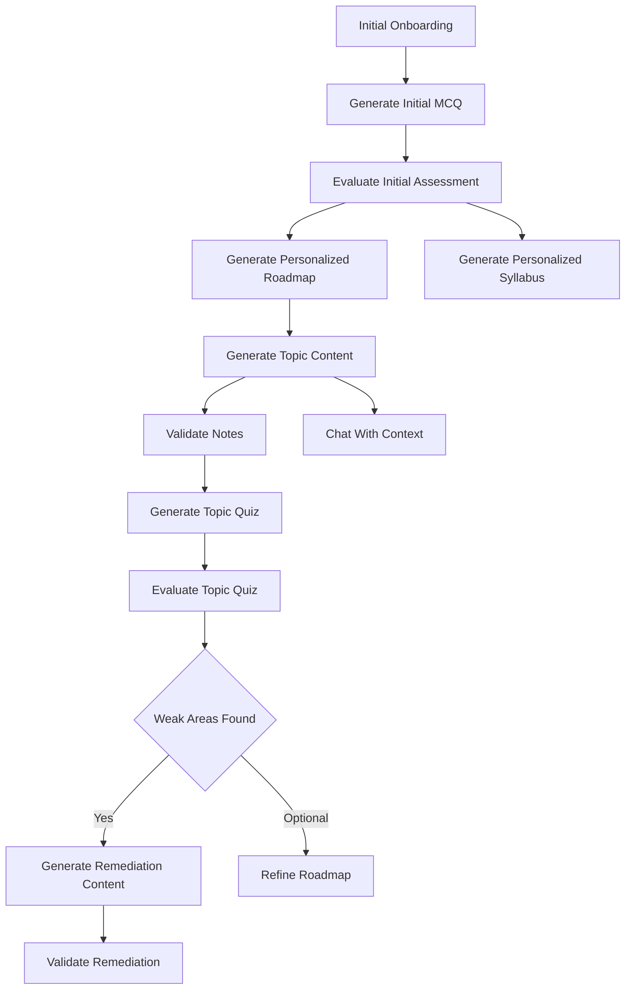

# `assessment_service.py`

## Architecture
- Pattern: `Monolithic assessment orchestration service`.
- Handles full learner progression lifecycle:
  - initial MCQ generation,
  - assessment evaluation,
  - roadmap/syllabus generation,
  - topic notes generation and validation,
  - topic quiz generation and scoring,
  - remediation generation and validation,
  - roadmap refinement,
  - context-aware tutor chat.
- Uses both direct generation calls and reviewer-gated retry loops (`validate_with_retry`).

## Workflow Diagram


## LLM Call Points
- `generate_initial_mcq` -> `_call_ollama(prompt, system_prompt)`
- `evaluate_initial_assessment` -> `generate_text(prompt, system_prompt, json_mode=True)`
- `generate_personalized_roadmap` -> `_call_ollama(prompt, system_prompt)`
- `generate_personalized_syllabus` -> `_call_ollama(prompt, system_prompt)`
- `generate_topic_content` -> `generate_text(prompt, system_prompt)` within `validate_with_retry`
- `generate_topic_quiz` -> `generate_text(prompt, json_mode=True)`
- `generate_remediation_content` -> `generate_text(prompt, system_prompt, json_mode=True)` within `validate_with_retry`
- `refine_roadmap` -> `generate_text(prompt, json_mode=True)`
- `chat_with_context` -> `generate_text(full_prompt, system_prompt=context-rich tutor prompt)`

## Prompt Families Used
### 1. Initial MCQ generation
```text
Generate exactly 10 multiple choice questions for course {course_name}.
Q1 asks self-rated level; Q2-Q10 conceptual/practical with correct_answer.
Return JSON only.
```

### 2. Initial assessment evaluation
```text
Evaluate diagnostic answers.
Extract knowledge_level from first answer, score questions 2-10,
identify weak_areas.
Return JSON: knowledge_level, score, weak_areas.
```

### 3. Personalized roadmap
```text
Create learning roadmap for {course_name} using knowledge level and weak areas.
Return 3-5 topics in JSON.
```

### 4. Personalized syllabus
```text
Design personalized syllabus with 4-8 modules, varied topic counts,
progressive difficulty, weak-area reinforcement.
Return strict JSON structure.
```

### 5. Topic notes
```text
Generate comprehensive markdown lesson content (800-1200+ words),
no bullet lists, strong conceptual flow, examples, misconceptions, best practices.
```

### 6. Topic quiz
```text
Generate 5 MCQs based ONLY on provided topic content.
Return strict JSON with question/options/correct_answer.
```

### 7. Remediation notes
```text
For each weak area, generate focused remediation notes (200-400 words),
clearer explanations, analogies, misconception fixes.
Return JSON remediation_notes array.
```

### 8. Tutor chat system prompt
```text
You are a helpful AI tutor for {course_name}/{topic_name}.
Use lesson content as primary knowledge base.
Be conversational, encouraging, thorough, markdown-formatted.
```
