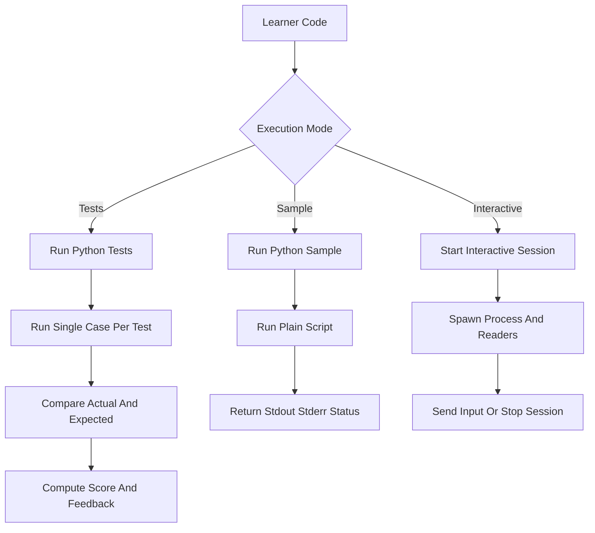

# `code_execution_service.py`

## Architecture
- Pattern: `Sandboxed execution engine + session manager`.
- Executes learner Python in temporary directories using subprocesses.
- Supports:
  - one-shot assertion-based test execution (`run_python_tests`),
  - one-shot script run (`run_python_sample`),
  - interactive stdin/stdout sessions with lifecycle management.
- Uses in-memory session registry with cleanup for stale sessions.

## Workflow Diagram

## LLM Prompt Usage
- No LLM calls.
- No `generate_text`/LangChain usage.

## Notes
- Contract-based test runner expects learner function `solve(raw_input: str) -> str` for test mode.
- Uses isolated interpreter mode (`python -I`) in non-interactive test/script runs.
