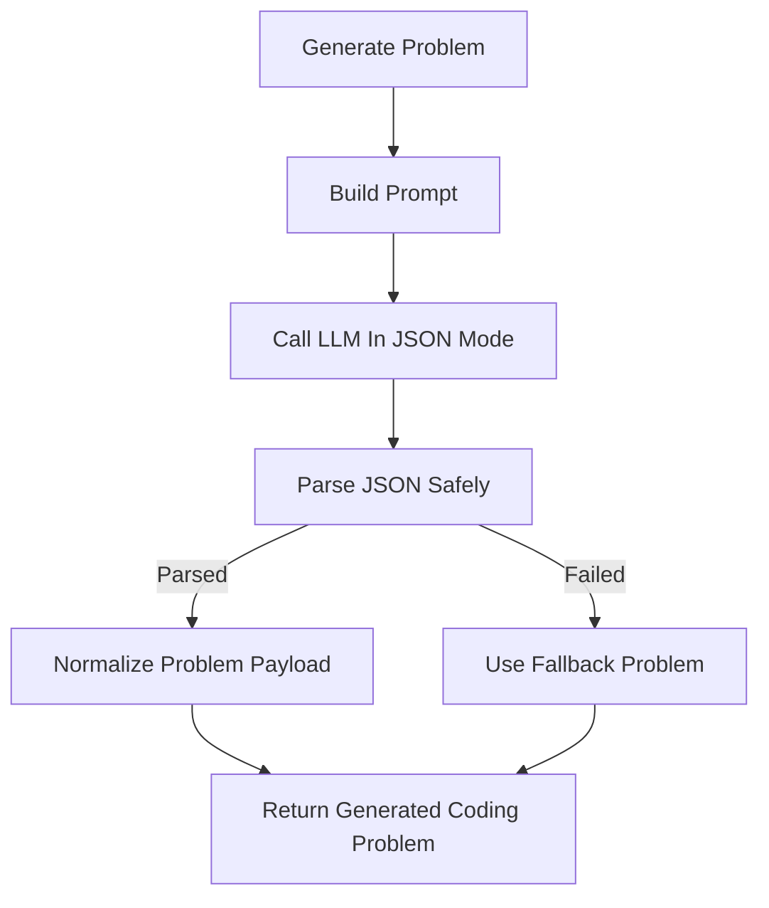

# `code_problem_service.py`

## Architecture
- Pattern: `Single-shot problem generation + strict normalization/fallback`.
- Generates one coding problem JSON, then hardens output with parsing, schema normalization, and fallbacks.
- Forces a stable output contract: starter code, reference solution, constraints, hints, visible/hidden tests.

## Workflow Diagram


## LLM Call Points
- `generate_problem(...)`
  - Call: `generate_text(prompt, system_prompt=..., json_mode=True, model=CODING_MODEL)`
  - Default model from settings: `CODING_MODEL` fallback `qwen2.5-coder:7b`.

## Prompt Used
### System Prompt
```text
You generate coding practice for learners. Return strict JSON only and keep problem statements concise and beginner-friendly.
```

### User Prompt Template (`_build_prompt`)
```text
Course: {course_name}
Topic: {topic_name}
Context: {topic_context[:2000]}

Generate ONE Python coding problem where the learner writes a function solve(raw_input: str) -> str.
Output JSON object with fields:
title, problem_statement, starter_code, reference_solution,
difficulty (easy|intermediate|difficult), constraints, hints,
visible_tests, hidden_tests.
At least 2 visible tests and 2 hidden tests.
No markdown fences. JSON only.
```
