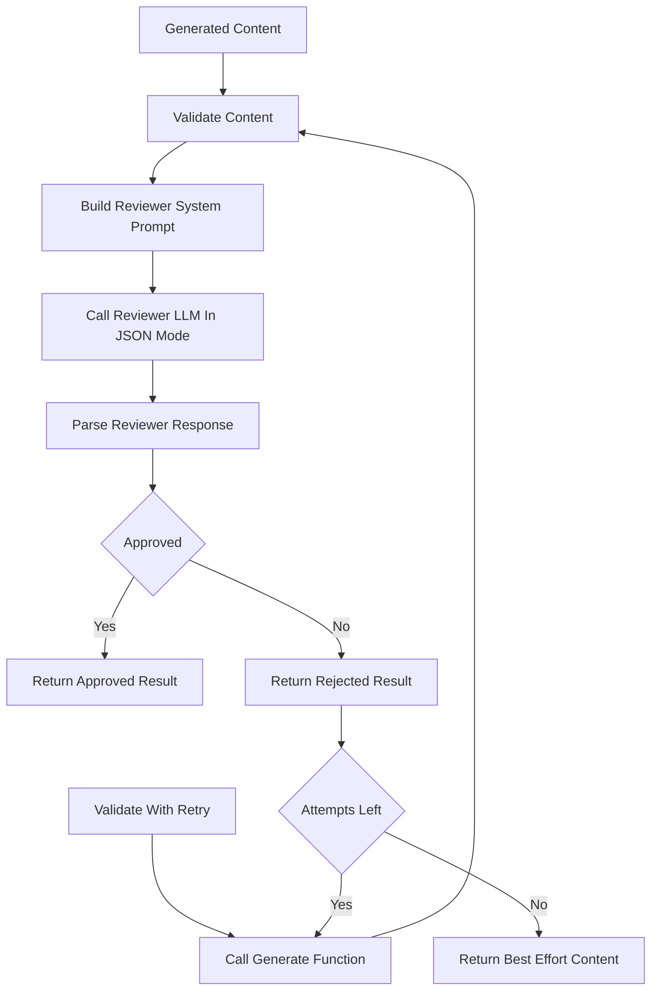

# `content_validator.py`

## Architecture
- Pattern: `Reviewer-agent gate with retry helper`.
- Adds a second-pass quality/safety filter for generated content.
- Returns structured `ValidationResult` (`approved`, `feedback`, `issues`).
- `validate_with_retry` orchestrates `generate -> review -> retry` loops.

## Workflow Diagram


## LLM Call Points
- `validate_content(...)`
  - Call: `generate_text(review_prompt, system_prompt=reviewer_system_prompt, json_mode=True)`

## Prompt Used
### Reviewer System Prompt Template
```text
You are a strict educational content reviewer AI.

Your job is to evaluate {content_type_label} generated about the topic: "{topic}".
[Optional user-specific requirements]

Evaluation Criteria:
1. RELEVANCE
2. QUALITY
3. COMPLETENESS
4. SAFETY
5. USER FIT

Respond with single JSON object:
{
  "approved": true|false,
  "feedback": "...",
  "issues": ["..."]
}
```

### Review Prompt Template
```text
Please review the following {content_type_label} and respond with ONLY the JSON object described in your instructions.

--- CONTENT START ---
{content[:6000]}
--- CONTENT END ---
```
