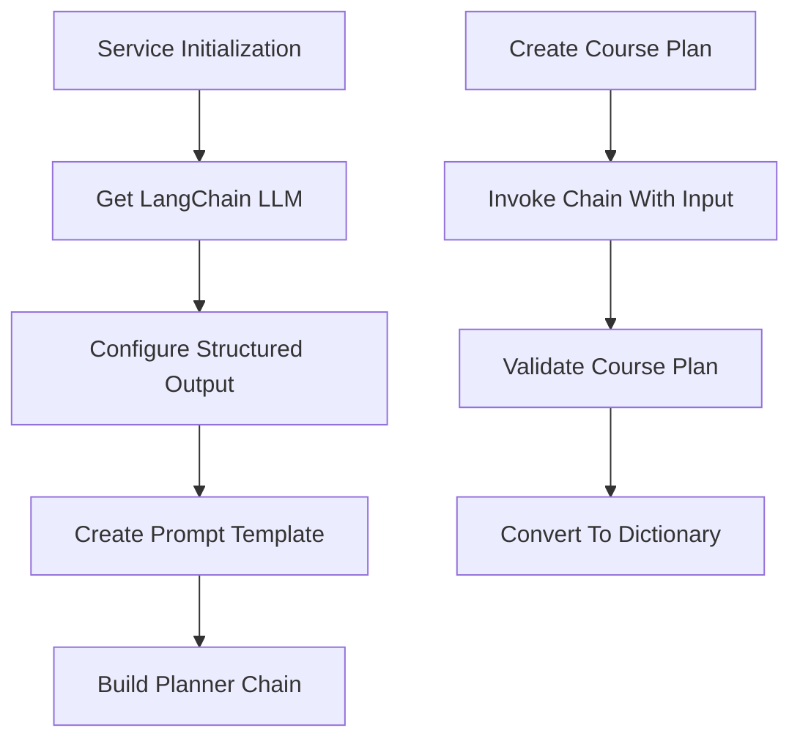

# `course_planning_service.py`

## Architecture
- Pattern: `LangChain structured-output planner`.
- Uses Pydantic schemas (`CourseModel`, `CoursePlan`) + validators.
- Builds a prompt chain once at initialization:
  - `ChatPromptTemplate` -> `llm.with_structured_output(CoursePlan)`.
- Produces typed course-planning output for broad vs narrow topics.

## Workflow Diagram


## LLM Call Points
- `self.chain.invoke({...})` in `create_course_plan(...)`.
- Backend comes from `ai_client.get_langchain_llm` (Featherless in production, Ollama in dev).

## Prompt Used
### System Prompt (summary)
```text
You are an expert curriculum designer and educational consultant.

Analyze whether topic is BROAD or NARROW.
- NARROW: exactly 1 course.
- BROAD: multiple logical non-overlapping courses, ordered Beginner -> Intermediate -> Advanced.

Rules:
- Difficulty must be exactly one of Beginner/Intermediate/Advanced.
- Prerequisites should reference earlier courses.
- total_courses must equal actual number of courses.
```

### User Prompt
```text
Create a course plan for:
Course Title: {course_title}
Course Description: {course_description}

Analyze broad vs narrow, then create an appropriate course plan.
```
