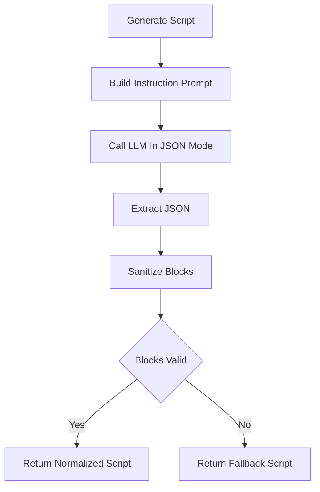

# `dynamic_script_service.py`

## Architecture
- Pattern: `Prompt-driven script generator + block sanitizer`.
- Generates interactive script JSON then normalizes to approved block types.
- Includes robust fallback script when model output is unusable.
- Supports optional caller-provided `system_prompt` for style personalization.



## LLM Call Points
- `generate_script(...)`
  - Call: `generate_text(instruction, system_prompt=system_prompt, json_mode=True)`

## Prompt Used
### Instruction Prompt Template
```text
Generate an interactive learning script for:
Course: {course_title}
Topic: {topic_name}
Topic description: {topic_description}
Existing lesson content excerpt: {lesson_content[:1800]}

Return ONLY JSON with:
{
  "schema_version": "1.0",
  "title": "...",
  "overview": "...",
  "blocks": [
    {
      "type": "text|code|video|mind_map|quiz",
      "prompt": "...",
      "payload": {}
    }
  ]
}

Requirements:
- At least one text block and one quiz block.
- Include code block when topic is coding-suitable.
- Keep sequence pedagogically sensible.
```
