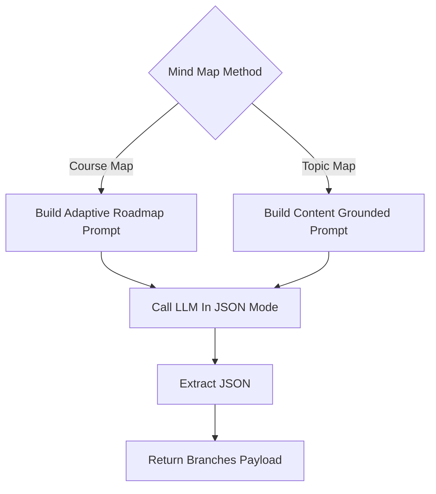

# `mindmap_service.py`

## Architecture
- Pattern: `Static utility service with strict JSON extraction`.
- Provides two mind-map generation paths:
  - course-level adaptive roadmap,
  - topic-level map strictly grounded in provided content.
- Uses regex-based JSON extraction and hard failure on invalid JSON.

## Workflow Diagram


## LLM Call Points
- `generate_course_mindmap(course_title, user_level)`
  - `generate_text(prompt, system_prompt=curriculum_json_only, json_mode=True)`
- `generate_topic_mindmap(topic_name, content)`
  - `generate_text(prompt, system_prompt=content_extractor_json_only, json_mode=True)`

## Prompts Used
### Course Mindmap Prompt (summary)
```text
You are a senior curriculum architect.
Generate a COMPLETE adaptive roadmap for {course_title}.
User Level: {user_level}

Rules:
- Topic 1 must be Introduction to {course_title}
- 6-10 main branches
- 4-7 subtopics per branch
- Return ONLY valid JSON in specified structure.
```

### Topic Mindmap Prompt (summary)
```text
Analyze topic content and extract core concepts into a hierarchical mind map.
MUST be strictly based ONLY on provided content.
- 3-6 branches
- 2-5 subtopics each
- Return ONLY valid JSON.
```

### System Prompts
- Course: `You are a curriculum expert that outputs valid JSON only.`
- Topic: `You are a content analyzer that strictly extracts hierarchical information from text and outputs valid JSON only.`
