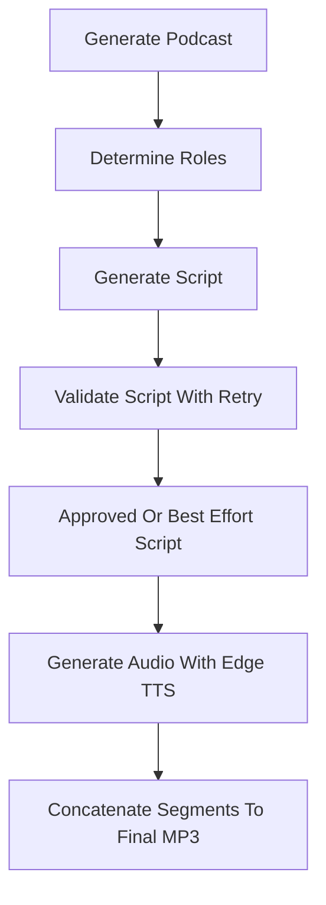

# `podcast_service.py`

## Architecture
- Pattern: `Multi-step podcast pipeline with reviewer gate + TTS rendering`.
- Stages:
  - persona options generation,
  - scenario options generation,
  - role selection,
  - conversation script generation with validation retries,
  - audio segment synthesis and concatenation.
- Uses `validate_with_retry` from `content_validator` for script quality control.

## Workflow Diagram


## LLM Call Points
- `generate_persona_options(text)` -> `generate_text(prompt, json_mode=True)`
- `generate_scenario_options(text, personas)` -> `generate_text(prompt, json_mode=True)`
- `_determine_roles(...)` -> `_call_ollama(role_prompt)` (legacy path in file)
- `_generate_script(...)` -> `generate_text(podcast_prompt, json_mode=True)` inside retry validator loop

## Prompts Used
### Persona Options Prompt (summary)
```text
Analyze content and propose 3 distinct persona pairs (Host 1/Host 2).
Return JSON: {"options":[{"person1":"...","person2":"..."}]}
```

### Scenario Options Prompt (summary)
```text
Propose 3 creative conversational scenarios for an audio overview.
Condition on selected personas when provided.
Return JSON: {"options":["..."]}
```

### Role Prompt (summary)
```text
Determine the two most suitable roles for conversation.
If instruction suggests personas, use them.
Return JSON: {"person1":"...","person2":"..."}
```

### Podcast Script Prompt (summary)
```text
Generate a natural, engaging conversation between {person1} and {person2}.
Use provided content, optional scenario instruction, and optional style guidance.
Return JSON:
{
  "conversation": [
    {"speaker":"...","text":"..."}
  ]
}
```
