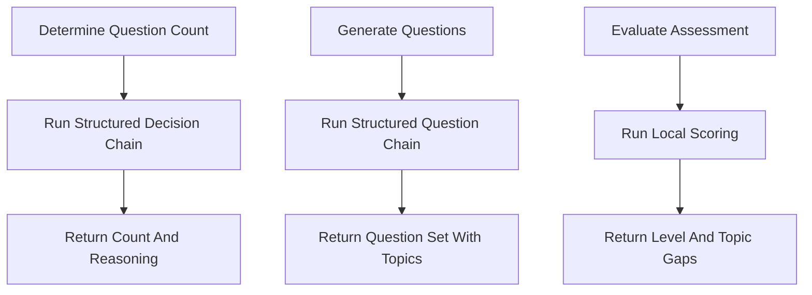

# `pre_assessment_service.py`

## Architecture
- Pattern: `LangChain structured assessment pipeline + local evaluator`.
- Uses typed Pydantic models: `Question`, `QuestionSet`, `QuestionCountDecision`, `AssessmentResult`.
- Two LLM stages:
  - decide optimal number of questions,
  - generate question set in strict structure.
- Grading is local and deterministic (no LLM call during evaluation).

## Workflow Diagram


## LLM Call Points
- `determine_question_count(...)`
  - `structured_llm = llm.with_structured_output(QuestionCountDecision)`
  - `chain = prompt | structured_llm`
- `generate_questions(...)`
  - `structured_llm = llm.with_structured_output(QuestionSet)`
  - `chain = prompt | structured_llm`

## Prompts Used
### Question Count System Prompt (summary)
```text
You are an expert educational assessment designer.
Choose 5-15 questions based on scope, difficulty, depth, prerequisites.
Guideline: simple 5-7, moderate 8-10, complex 11-15.
```

### Question Generation System Prompt (summary)
```text
You are an expert educator creating pre-assessment questions.
Generate {num_questions} MCQs.
CRITICAL:
- Exactly 4 options.
- Option index 3 must be exactly "I don't know about this course".
- Correct answer index must be 0/1/2.
- Include topic field and difficulty hints.
- Use beginner/intermediate/advanced distribution.
```

### User Prompt Inputs
- Course name
- Course description
- Difficulty level
- Number of questions
