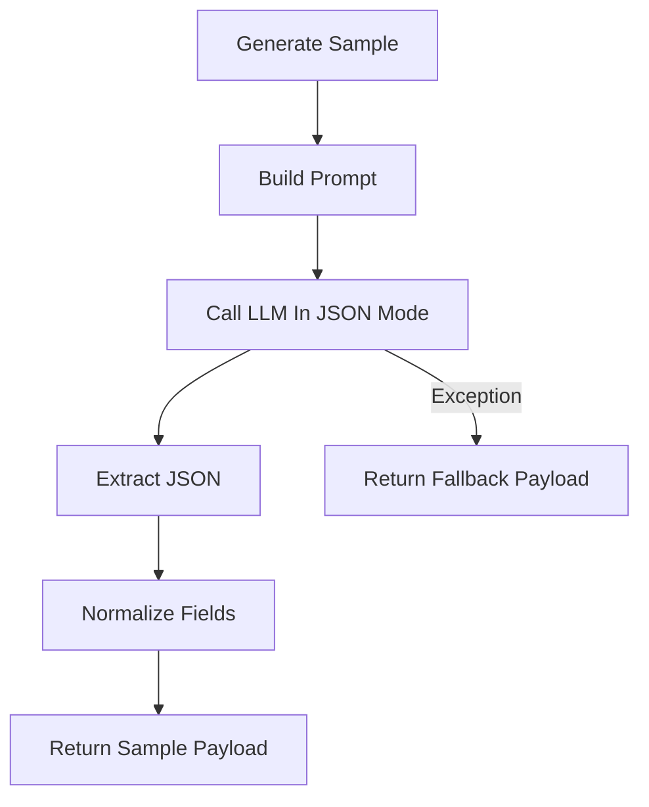

# `sample_code_service.py`

## Architecture
- Pattern: `Minimal one-shot generator with safe fallback`.
- Generates a teaching code sample JSON for a topic.
- Parses JSON from model output with regex extraction.
- Falls back to a default editable `solve(raw_input)` sample on failure.

## Workflow Diagram


## LLM Call Points
- `generate_sample(...)`
  - Call: `generate_text(prompt, json_mode=True)`

## Prompt Used
```text
Generate a Python teaching sample for the topic below.

Course: {course_title}
Topic: {topic_name}
Context: {topic_content[:1200] or N/A}

Return only valid JSON:
{
  "title": "string",
  "explanation": "short teaching explanation",
  "starter_code": "python code defining solve(raw_input: str) -> str",
  "sample_input": "optional input string"
}

Requirements:
- Code must be runnable and editable.
- No test cases.
- Keep concise and educational.
```
