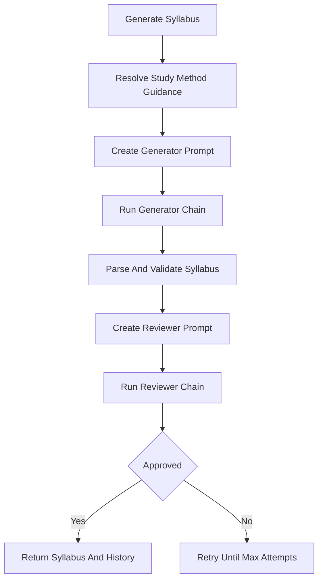

# `syllabus_service.py`

## Architecture
- Pattern: `Two-layer generator-reviewer LangChain pipeline`.
- Layer 1: syllabus generator LLM + custom parser (`CustomSyllabusParser`) for JSON cleanup and empty-module filtering.
- Layer 2: reviewer LLM with structured decision (`SyllabusReview`).
- Adapts prompt using:
  - study method preference (`real_world`, `theory_depth`, `project_based`, `custom`),
  - optional pre-assessment knowledge profile.

## Workflow Diagram


## LLM Call Points
- Generator chain invoke:
  - `generator_prompt | generator_llm | syllabus_parser`
- Reviewer chain invoke:
  - `reviewer_prompt | reviewer_llm.with_structured_output(SyllabusReview)`

## Prompts Used
### Generator System Prompt (high-level)
```text
You are an expert curriculum designer creating a detailed course syllabus.
Includes STUDY METHOD PREFERENCE and optional KNOWLEDGE ADAPTATION.

Rules:
- 5-12 modules, each with 2-5 topics.
- No empty modules.
- Logical progression foundation -> advanced.
- Distinct topics, realistic durations.
- Return ONLY valid JSON in required structure.
```

### Reviewer System Prompt (high-level)
```text
You are a supportive educational QA expert. Be lenient.
Evaluate structure, quality, redundancy, completeness, realism.
Reject only for fundamental flaws (off-topic, empty/gibberish, broken order, duplicate modules).
```

### User Prompt Inputs
- `course_name`, `course_description`, `difficulty`
- optional study method custom text
- optional assessment-derived known/weak/unknown topics injected via generator system prompt
