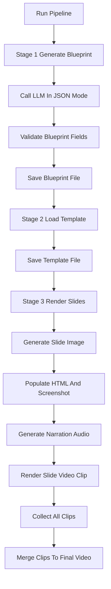

# `video_generator.py`

## Architecture
- Pattern: `Three-stage media pipeline orchestrator`.
- Stage 1: LLM creates structured video blueprint JSON.
- Stage 2: Theme-based HTML template selection (hardcoded premium templates).
- Stage 3: Render pipeline:
  - optional image generation from `image_prompt` (Stable Diffusion),
  - HTML slide composition + screenshot capture,
  - narration TTS generation,
  - per-slide video clip render via FFmpeg,
  - final concat merge.
- Tracks progress by updating `VideoTask` model.

## Workflow Diagram


## LLM Call Points
- `_llm_call(system_prompt, user_prompt, json_mode=False)`
  - Combines system + user prompt into one text block.
  - Calls: `generate_text(combined_prompt, json_mode=json_mode)`
- `stage1_generate_blueprint(...)`
  - Calls `_llm_call(..., json_mode=True)` with retry loop.

## Prompt Used
### Stage 1 System Prompt (core)
```text
You are an expert AI educational video architect.
Design a structured video plan for a high-quality 1080p educational video.

CRITICAL:
1. Return ONLY valid JSON.
2. theme must be one of modern_dark/light_minimal/gradient_academic.
3. Every slide needs non-empty title.
4. Every slide needs non-empty narration (2-4 conversational sentences).
5. Every slide needs non-empty image_prompt.
6. Every slide needs at least 2 sub_points.
7. Generate exactly 6-10 slides.
```

### Stage 1 User Prompt Template (summary)
```text
Design a video blueprint for topic: {topic}
[Optional lesson content context injected]

Output exact JSON structure:
{
  "theme": "modern_dark",
  "video_style": "cinematic",
  "slides": [
    {
      "layout": "title_bullets",
      "title": "...",
      "sub_points": ["..."],
      "image_prompt": "...",
      "narration": "..."
    }
  ]
}

Constraints:
- 6-10 slides, intro first, summary last,
- sub_point < 12 words, max 5 per slide,
- no empty fields.
```

## Non-LLM Prompt Use
- Image-generation prompt template in `generate_image_sd`:
```text
simple flat illustration of {image_prompt}, minimal design, clean white background, educational graphic, vector style, no text
```
